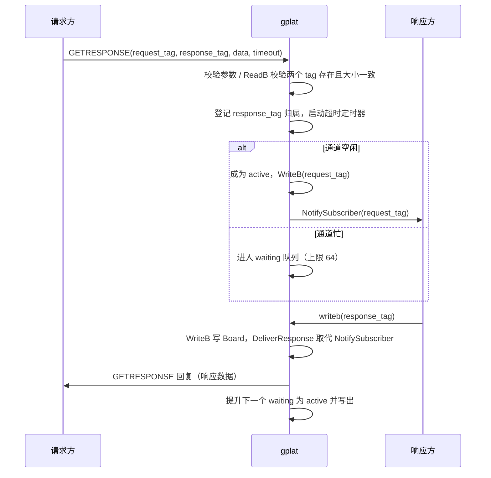

# 260926-05 gplat 请求-响应（getresponse）功能

需求来源：[Doc/tasks/20260926.md](../tasks/20260926.md)

## 1. 需求要点

- 客户端 A 写入请求数据，客户端 B 通过订阅收到请求，处理后写回响应，A 收到响应。
- A 在等待响应期间，gplat 不得向 A 的连接推送其它订阅事件（需在服务端排队，结束后再推送）。
- 同名请求（request_tag 相同）在服务端同一时刻只能处理 1 个，后续请求阻塞排队。
- 默认超时 2 秒；无人等待的响应要丢弃并记日志。
- 测试程序 testapp5；请求/响应类型定义在 `include/user_types.h`。

## 2. 决策过程

编码前通过两轮问答澄清了技术细节，结论如下。

### 2.1 实现方式

| 方案 | 说明 | 结论 |
|---|---|---|
| A | 新增专用消息 `GETRESPONSE`，客户端一次往返，服务端完成串行化、写请求、挂起、投递响应、超时 | **采用** |
| B | 客户端按需求原文组合 writeb + subscribe + waitpostdata，再补充“过滤等待”和取消订阅协议 | 放弃 |

放弃方案 B 的原因：
- 服务端无法区分普通 writeb 和“请求”，做不了同名请求串行化；
- 现有 `waitpostdata` 直接取 `m_listPost` 队首，不能只接收指定 tag，需要新增过滤协议；
- `CANCELSUBSCRIBE` 目前是 noop，请求方订阅 response_tag 后会一直收到别人的响应。

方案 A 中请求方连接不新增订阅；它不处于 `m_bWaitingPost` 状态，其它事件自然留在 `m_listPost` 中排队，天然满足“等待期间禁止推送其它事件”。

### 2.2 细节决策

| 问题 | 决策 |
|---|---|
| 超时参数 | 签名末尾增加 `int timeout_ms`，C++ 默认值 2000；必须 > 0，否则 `ERROR_INVALID_PARAMETER` |
| 排队时间是否计入超时 | 计入：从服务端收到请求开始计时 |
| 串行化键 | 只按 request_tag 互斥；response_tag 不得被多个 request_tag 共用（服务端强制检查） |
| 排队上限 | 每个 request_tag 独立上限 64（不含正在处理的），超出返回 `ERROR_REQUEST_QUEUE_FULL` |
| 触发投递的写接口 | 仅 `writeb`（start==1）；`writeb_notpost`、`writeb_string` 不投递 |
| response_tag 识别 | 服务端记录进程生命周期内出现过的所有 response_tag |
| response_tag 普通订阅 | 写 Board，但始终不通知普通订阅者 |
| 无人等待的响应 | 丢弃并记 WARN 日志；响应方 writeb 仍返回成功 |
| request_tag 无订阅者 | 照常等待直到超时 |
| 请求方断开 | 释放其请求、取消定时器、调度下一个排队请求；之后的响应按“无人等待”处理 |
| tag 预创建 | 两个 tag 必须事先存在；request_size、response_size 必须等于 tag 大小（沿用 ReadB/WriteB 错误码） |
| 错误码 | 新增 `ERROR_RESPONSE_TIMEOUT`、`ERROR_REQUEST_QUEUE_FULL`（Ignore 级别） |
| 同一 sockfd 多线程 | 不支持 |
| 类型命名 | `Request` / `Response`（修正需求中 Reponse 的拼写），注册反射 |
| testapp5 | 仅 Makefile 目标，不加 vcxproj |
| 日志 | `ngx_log_error_core(NGX_LOG_WARN, ...)` 写 `../logs/gplat.log` |

### 2.3 编码中发现的问题

`include/higplat.h` 中 `GetLastErrorQ()` 声明为 `bool`，而实现返回 `unsigned int`，导致所有服务端 handler 回给客户端的错误码被截断为垃圾值。经确认修正为 `unsigned int`。

影响：`ERROR_TAG_NOT_EXIST`、`ERROR_RECORDSIZE` 等在 `GetErrorInfo` 中为 Fatal 级别，修正后客户端 `AutoErrorCheck` 在这些错误时会抛异常（以前因为错误码是垃圾值被当作 unknown/Ignore）。

## 3. 最终技术方案

### 3.1 协议

- `include/msg.h`：`MSGID` 末尾追加 `GETRESPONSE`（= 54）。
- 请求包 `MSGHEAD` 字段复用：

| 字段 | 含义 |
|---|---|
| `itemname` | request_tag |
| `qname` | response_tag |
| `datasize` / `bodysize` | 请求数据大小 |
| `recsize` | 响应数据大小 |
| `timeout` | 超时毫秒 |
| body | 请求数据 |

- 回复包：`id = GETRESPONSE`，`error` 为错误码；成功时 `bodysize = response_size`，body 为响应数据。

### 3.2 客户端 API（`higplat/higplat.cpp`）

```cpp
extern "C" bool getresponse(int sockfd, const char* request_tag, void* request_value, int request_size,
                            const char* response_tag, void* response_value, int response_size,
                            unsigned int* error, int timeout_ms = 2000);
```

- 本地参数校验 → 发送包头 + 请求数据 → 阻塞读取回复包头；
- `error != 0` 直接返回 false（不关闭连接，连接可继续使用）；
- 校验 `bodysize == response_size` 后读取响应数据。

### 3.3 服务端数据结构（`gplat/ngx_c_slogic.h`）

```cpp
struct PendingRequest {
    lpngx_connection_t pConn;
    uint64_t iCurrsequence;         // 回复时用于发送线程识别过期连接
    std::string requestTag, responseTag;
    std::vector<char> requestData;
    int responseSize;
    int timerId{ -1 };
};

struct RequestChannel {
    PendingRequestPtr active;                 // 正在等待响应的请求
    std::deque<PendingRequestPtr> waiting;    // 排队中的同名请求
};

std::mutex m_reqMutex;
std::map<std::string, RequestChannel> m_mapReqChannel;   // request_tag -> 通道
std::map<std::string, std::string> m_mapResponseOwner;   // 出现过的 response_tag -> request_tag
```

### 3.4 处理流程



关键函数（`gplat/ngx_c_slogic.cxx`）：

| 函数 | 职责 |
|---|---|
| `HandleGetResponse` | 校验、登记、启动定时器、入队或立即开始 |
| `StartRequest` | `WriteB` 请求 tag 并 `NotifySubscriber`；写失败则回错误并继续下一个 |
| `DeliverResponse` | 由 `HandleWriteB`（start==1）调用；返回 false 表示不是 response_tag，走普通通知；否则投递给 active 请求或记日志丢弃 |
| `OnRequestTimeout` | 定时器回调，摘除请求并回 `ERROR_RESPONSE_TIMEOUT` |
| `DetachRequestLocked` | 从通道摘除请求（active 或 waiting），取消定时器，返回下一个要激活的请求 |
| `SendGetResponseReply` | 构造回复包并 `msgSend` |
| `CancelRequest` | 连接断开时释放该连接的所有请求 |

### 3.5 并发与锁

- `m_reqMutex` 只保护两个表；**持有期间禁止获取连接锁 `logicPorcMutex`**。`WriteB`、`NotifySubscriber`、`msgSend` 都在锁外执行，避免与订阅者连接锁形成环。
- `CancelRequest` 在 `ngx_read_request_handler` 断开分支中、获取本连接 `logicPorcMutex` **之前**调用，因为它可能激活下一个请求并通知订阅者（包括本连接自身）。
- 定时器回调捕获 `weak_ptr<PendingRequest>`；请求是否仍有效以“在通道中能否找到”为准，已完成请求的迟到回调直接返回。
- 回复包使用请求到达时的 `iCurrsequence`，连接断开或被复用后由发送线程丢弃，无需持连接锁。
- 已知极小窗口：请求在 `StartRequest` 写出的瞬间恰好超时，下一个排队请求可能与之几乎同时写出。影响仅限已超时的请求，未做额外处理。

### 3.6 错误码

| 错误码 | 值 | 级别 | 场景 |
|---|---|---|---|
| `ERROR_RESPONSE_TIMEOUT` | 1044 | Ignore | 超时（含排队时间） |
| `ERROR_REQUEST_QUEUE_FULL` | 1045 | Ignore | 同名请求排队已满 |
| `ERROR_INVALID_PARAMETER` | 1039 | Ignore | 参数非法、request_tag == response_tag、response_tag 被其它 request_tag 占用 |
| `ERROR_TAG_NOT_EXIST` / `ERROR_RECORDSIZE` | 1042 / 1014 | Fatal | tag 不存在或大小不符 |

定义同时加入 `include/higplat.h` 和 `higplat/qbd.h`，`GetErrorInfo` 增加对应条目。

### 3.7 类型定义（`include/user_types.h`）

```cpp
struct Request  { int32_t id; int32_t cmd;    PodString<32> name;    double args[4];   };
struct Response { int32_t id; int32_t result; PodString<64> message; double values[4]; };
```

均已 `REGISTER_STRUCT` 并加入 `struct_registry.h`。

## 4. 测试（testapp5）

响应线程订阅 `TEST5_REQ`、`TEST5_SLOW_REQ`，同时订阅 `TEST5_RSP` 以验证 response_tag 不会推给普通订阅者。

| 场景 | 验证点 |
|---|---|
| 1 基本请求-响应 | 20 次请求，id 与数据一一对应 |
| 2 预订阅其它事件 | 请求方先订阅 `timer_500ms` 并等待事件排队，10 次 getresponse 不受干扰，结束后 `waitpostdata` 能收到 `timer_500ms` |
| 3 并发同名请求 | 4 线程 × 25 次；响应方处理期间 `readb` 请求 tag 确认未被覆盖（串行化） |
| 4 超时与迟到响应 | 超时 500ms、响应方延迟 1500ms：返回 `ERROR_RESPONSE_TIMEOUT` 且耗时符合预期；服务端记录丢弃日志；超时后同一连接仍可正常请求 |

结果：连续运行两次均 `ALL PASSED`，`logs/gplat.log` 中出现预期的“getresponse超时”和“丢弃无人等待的响应”日志。

注：testapp5 会在 BOARD 中创建 4 个 tag（`TEST5_REQ`、`TEST5_RSP`、`TEST5_SLOW_REQ`、`TEST5_SLOW_RSP`），已存在时复用。

## 5. 改动文件

| 文件 | 改动 |
|---|---|
| `include/msg.h` | 新增 `GETRESPONSE` |
| `include/higplat.h` | 新增错误码、`getresponse` 声明；修正 `GetLastErrorQ` 返回类型 |
| `higplat/qbd.h` | 新增错误码及 `GetErrorInfo` 条目 |
| `higplat/higplat.cpp` | 实现 `getresponse` |
| `gplat/ngx_c_slogic.h` / `.cxx` | 请求通道数据结构与处理逻辑；注册 handler；`HandleWriteB` 接入 `DeliverResponse` |
| `gplat/ngx_c_socket.h` | 新增虚函数 `CancelRequest` |
| `gplat/ngx_c_socket_request.cxx` | 断开时调用 `CancelRequest` |
| `include/user_types.h` / `struct_registry.h` | `Request` / `Response` 类型 |
| `testapp5/main.cpp`、`Makefile` | 新测试程序及构建目标 |
| `Doc/api_reference.md`、`Doc/ERROR_CODE.md`、`CLAUDE.md` | 文档同步 |

附聊天对话：
技术细节已经全部确认，还没有开始写代码。确认的结论如下：

协议与 API

新增一个专用消息 GETRESPONSE，客户端发一次请求、收一次回复就完成。请求方的连接不会新增订阅；其它事件照常留在服务端 m_listPost 里排队，getresponse 返回后再推送。
函数签名末尾加 int timeout_ms = 2000，取值必须 > 0，否则返回 ERROR_INVALID_PARAMETER。
新增错误码 ERROR_RESPONSE_TIMEOUT 和 ERROR_REQUEST_QUEUE_FULL。
request_tag 和 response_tag 都必须事先创建。request_size 和 response_size 都必须等于对应 tag 的大小，不相等时沿用 writeb 的错误码。
同一个 sockfd 不支持多线程同时调用。
服务端行为

串行化：只按 request_tag 互斥，约定不同请求不共用同一个 response_tag。每个 request_tag 最多排队 64 个请求（不含正在处理的那个），超出立即返回 ERROR_REQUEST_QUEUE_FULL。
超时：从服务端收到请求开始计时，排队时间也算在内。request_tag 没有订阅者（没有响应方）时，照常等到超时。
响应投递：只有 writeb（start==1）写 response_tag 才会投递给请求方，writeb_notpost 不投递。
response_tag 识别：服务端在进程运行期间记住所有用过的 response_tag。写这些 tag 时照常写 Board，但始终不通知普通订阅者。
无人等待的响应：写入时如果没有挂起的请求，服务端写日志（ngx_log_error_core，NGX_LOG_WARN），响应方的 writeb 仍返回成功。
请求方断开：释放它占用的锁，取消超时定时器，接着处理下一个排队的请求。
测试与文档

类型：在 user_types.h 中定义 Request 和 Response（改正了需求里 Reponse 的拼写），并注册反射，字段由我设计。
testapp5：只加 Makefile 目标，不加 vcxproj。测试以下四个场景：
基本请求-响应，校验 id 一一对应
请求方事先订阅 timer_500ms，验证 getresponse 期间不被打断，结束后能收到排队的事件
多个线程同时发同名请求，验证串行化
响应方故意不响应，验证超时和迟到响应的日志
文档：同步更新 api_reference.md、ERROR_CODE.md 和 CLAUDE.md。
这些结论已记录在本次会话的笔记里，确认后即可开始编码。

-----------------------------------------------------------------

getresponse 已经按确认的方案实现。我在本机启动 gplat 后连续跑了两遍 testapp5，四个场景都通过（ALL PASSED）。服务端日志里也有预期的"getresponse超时"和"丢弃无人等待的响应"两条记录。测试完后我停掉了自己启动的 gplat。

两处需要你留意：

GetLastErrorQ 声明已按你的选择改为 unsigned int（higplat.h）。原来声明为 bool，服务端回给客户端的错误码都是截断后的错值。改正后，遇到 ERROR_TAG_NOT_EXIST、ERROR_RECORDSIZE 这类 Fatal 级错误时，客户端会抛异常，而以前不会，现有客户端的行为会随之改变。
testapp5 会在 BOARD 文件里创建 4 个 tag：TEST5_REQ、TEST5_RSP、TEST5_SLOW_REQ、TEST5_SLOW_RSP。它们会留在 BOARD 里；已存在时直接复用，所以可以重复运行。
改动内容：

协议：msg.h 新增 GETRESPONSE（编号 54）。higplat.h 和 qbd.h 新增 ERROR_RESPONSE_TIMEOUT（1044）和 ERROR_REQUEST_QUEUE_FULL（1045），都是 Ignore 级别。

客户端：higplat.cpp 实现了 getresponse，一次发送、一次接收完成请求和响应。

服务端（ngx_c_slogic.cxx）：

收到请求后先检查两个 tag 是否存在、大小是否一致；同一 request_tag 同时只处理一个，其余排队，最多 64 个。
每个请求从服务端收到时开始计时，排队时间也算在超时里。
用过的 response_tag 被 writeb（start==1）写入时，只写 Board 并回给等待的请求方，不通知普通订阅者；无人等待时写 WARN 日志。
请求方断开时，由 ngx_c_socket_request.cxx 中新加的 CancelRequest() 释放它的请求，并继续处理下一个排队请求。
规则变成了强制检查：同一个 response_tag 如果被第二个 request_tag 使用，会直接返回 ERROR_INVALID_PARAMETER，而不只是口头约定。

类型：user_types.h 新增 Request 和 Response，已注册到 struct_registry.h，toolgplat 可以按字段显示。

测试：main.cpp 覆盖四个场景：

基本请求-响应，校验 id 一一对应；
请求方事先订阅 timer_500ms，调用期间不受干扰，结束后能收到排队的事件；
4 个线程同时发同名请求，响应方处理期间检查请求 tag 没被覆盖，并确认写 response_tag 不会推给普通订阅者；
故意不及时响应，验证超时和迟到响应的日志。
Makefile 新增了 testapp5 和 clean-testapp5。

文档：更新了 api_reference.md、ERROR_CODE.md 和 CLAUDE.md。

还有一个已知的极小概率情况：请求刚好在服务端把它写出的那一瞬间超时，下一个排队请求可能与它几乎同时发给响应方。